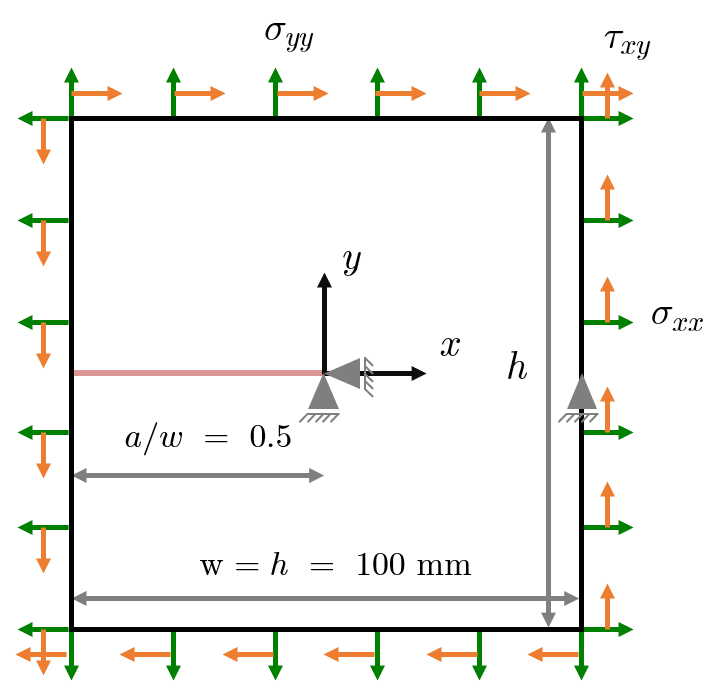
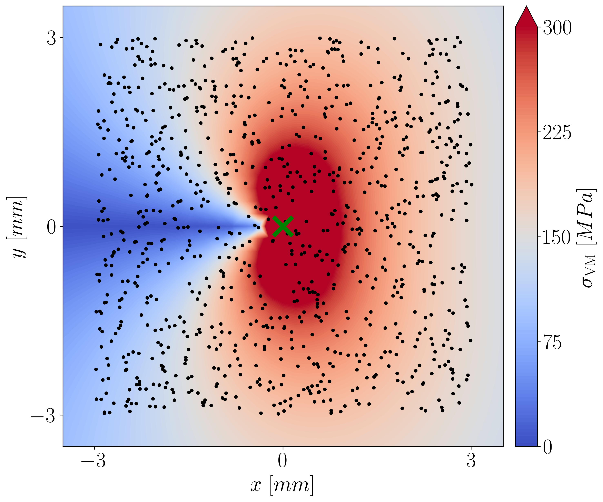
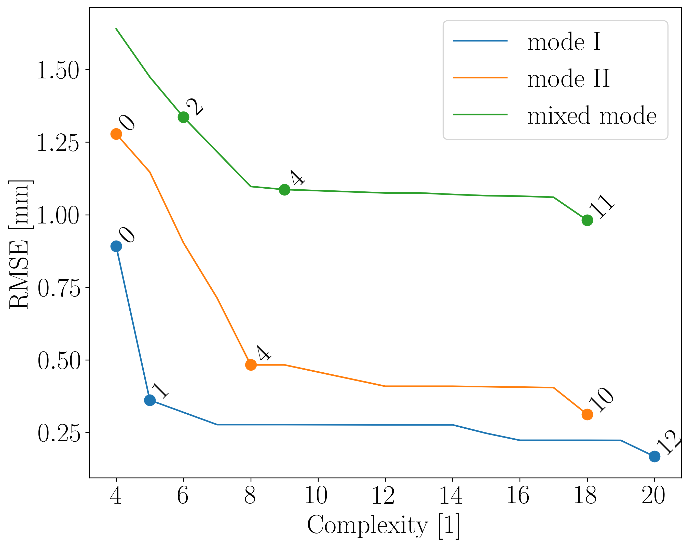
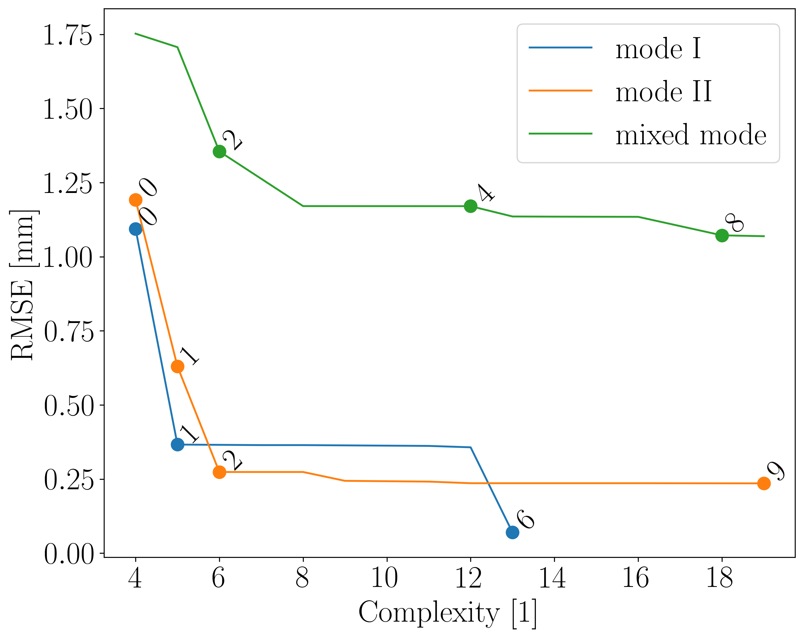
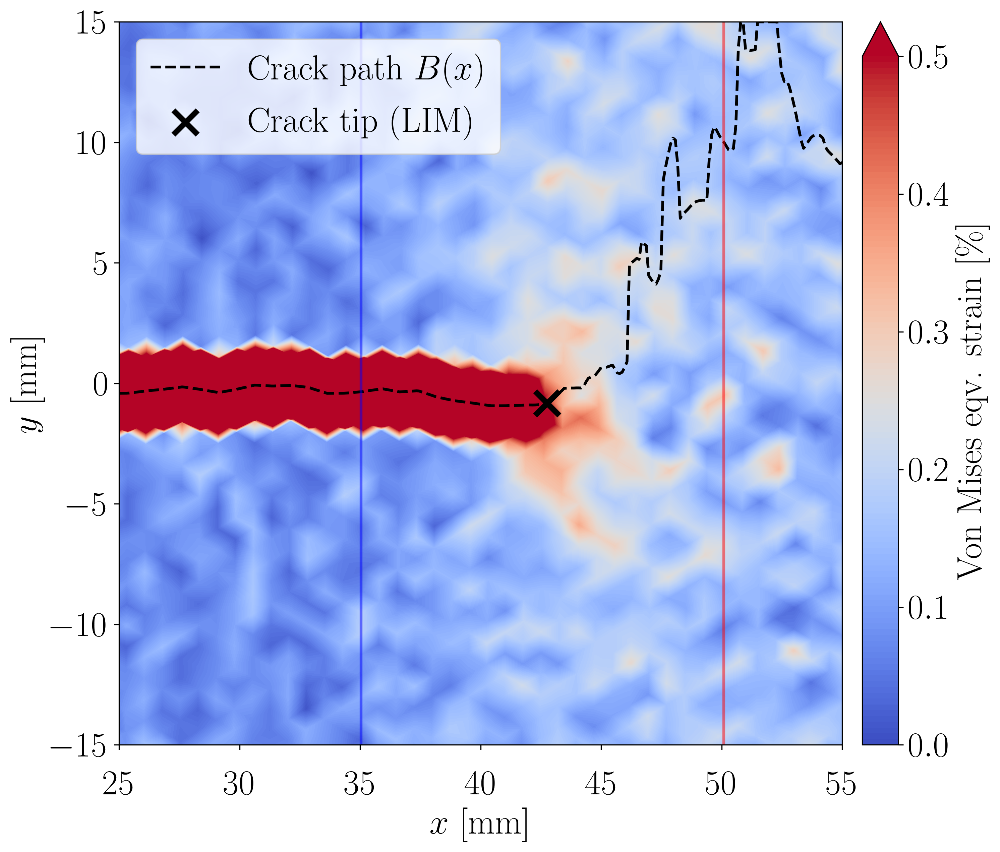
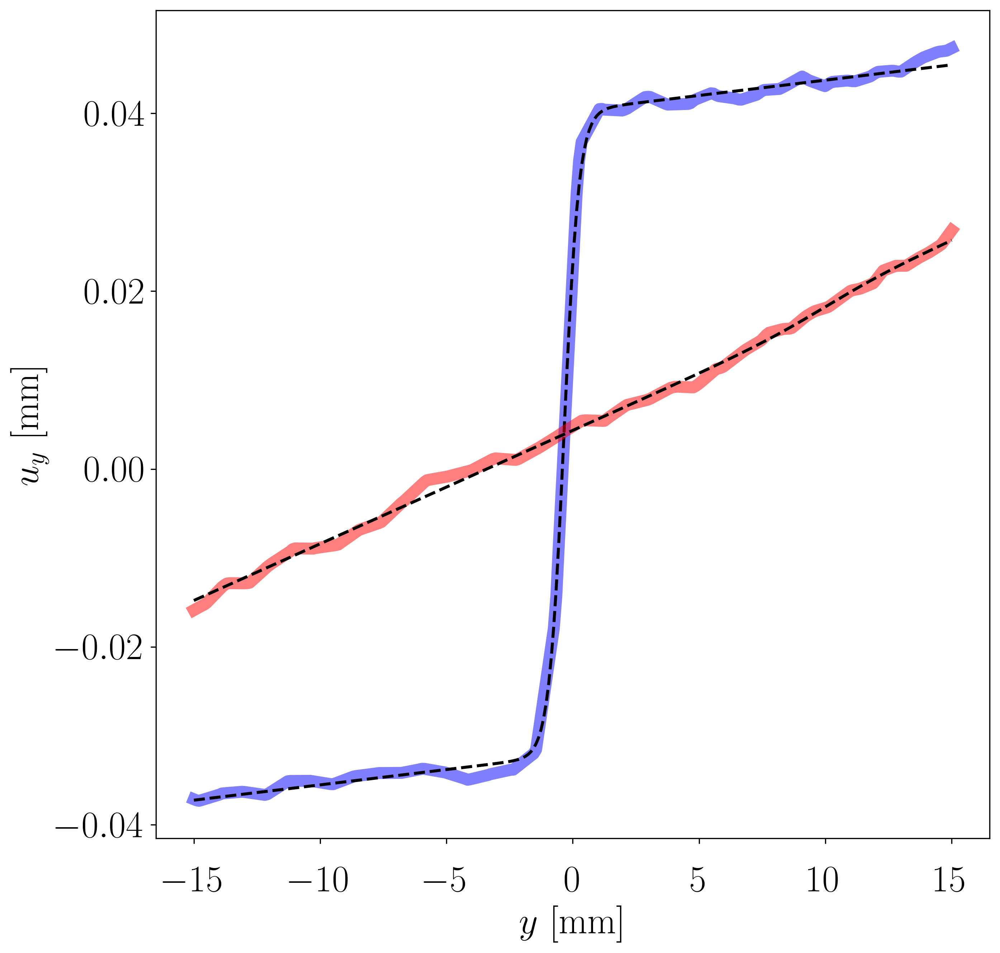
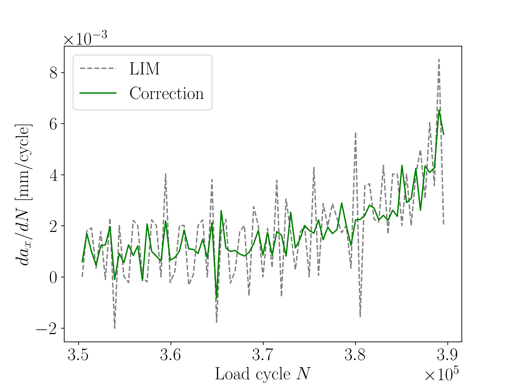

# Crack tip correction

This repository contains the code used to generate the results of the research article
```
David Melching, Tobias Strohmann, Florian Paysan and Eric Breitbarth. (2024)
A universal crack tip correction algorithm discovered by physical deep symbolic regression. 
```
The preprint is available on <a href="https://doi.org/10.48550/arXiv.2403.10320" target="_blank">arXiv</a>.
All data resulting from this study is available on <a href="https://doi.org/10.5281/zenodo.10730749" target="_blank">Zenodo</a>.

## Abstract
*Digital image correlation is a widely used technique in the field of experimental mechanics.
In fracture mechanics, determining the precise location of the crack tip is crucial. In this paper,
we introduce a universal crack tip detection algorithm based on displacement and strain fields
obtained by digital image correlation. Iterative crack tip correction formulas are discovered
by applying deep symbolic regression guided by physical unit constraints to a dataset of
simulated cracks under mode I, II and mixed-mode conditions with variable T-stress. For
the training dataset, we fit the Williams series expansion with super-singular terms to the
simulated displacement fields at randomly chosen origins around the actual crack tip. We
analyse the discovered formulas and apply the most promising one to digital image correlation
data obtained from uniaxial and biaxial fatigue crack growth experiments of AA2024-T3 sheet
material. Throughout the experiments, the crack tip positions are reliably detected leading to
improved stability of the crack propagation curves.*

## Dependencies
*  <a href="https://www.python.org/downloads/release/python-311/" target="_blank">Python 3.11</a>
*  <a href="https://www.ansys.com/" target="_blank">Ansys Mechanical</a>: 
To run the simulations, we used Ansys Mechanical APDL 2023 R1.
*  <a href="https://github.com/dlr-wf/crackpy" target="_blank">CrackPy</a>: 
We used CrackPy version 1.2.0 to determine the Williams coefficients. 

## Installation

1. Create a virtual environment of Python 3.11 and activate it.
2. Install the required packages using the following command:
```shell
pip install -r requirements.txt
```
3. Install the CrackPy package using the following command:
```shell
pip install --upgrade git+https://gitlab.dlr.de/wf_mhw/crackpy.git@develop
```
4. Install the PhySO package using the following command:
```shell
pip install --upgrade git+https://github.com/WassimTenachi/PhySO.git
```

The repository contains the following folders:

* `cracktipcorr`: The main package containing the code for crack tip correction.
* `docs`: Documentation folder containing images for this README.
* `scripts_paper`: The scripts used to generate results and particularly the plots of the paper.

In addition, the repository contains script, which should be executed consecutively to generate the results:

## Data generation

- `01_finite_element_model.py`: Generate FE data using Ansys Mechanical and pyansys.

|  |  |
|:------------------------------------------------------------------------------:|:---------------------------------------------------------------------------------------------------------------:|
|                  **Finite element model for the simulations**                  |                             **Random samples overlayed with the von Mises stress**                              |

The script goes through several load cases and saves the displacement and strain data ("nodemaps") 
together with plots of the mesh, displacements and von Mises stress in a folder called `01_Simulation_Output`.

- `04_crackpy_random_evaluation_pipeline.py`: Run CrackPy for 1000 randomly shifted crack tip positions 
for each nodemaps in 01_Simulation_Output folder.

The results are saved in a folder called `04_CrackPy_random_evaluation_pipeline`.
We are particularly interested in the Williams coefficients, which are determined by fitting the theoretical field to
the simulation data.

## Physical deep symbolic regression

Our goal is to learn a crack tip correction function taking the Williams coefficients as input and outputting the
correction vector to arrive at the actual crack tip position. We use the PhySO package [REF] to train a symbolic regression
model to learn this function from the simulation data.

- `05_1_SymbolicRegression_PhySO_mode_I.py`: Perform symbolic regression only using mode I load cases.
- `05_2_SymbolicRegression_PhySO_mode_II.py`: Perform symbolic regression only using mode II load cases.
- `05_3_SymbolicRegression_PhySO_mixed_mode.py`: Perform symbolic regression using all load cases (mode I, mode II, and mixed mode).

The results are saved in folders called `05_1_PhySO_log_mode_I`, `05_2_PhySO_log_mode_II`, and `05_3_PhySO_log_mixed_mode`, respectively.

## Discovered formulas and pareto front

During training of the symbolic regression model, we obtain a set of formulas that trade off complexity and accuracy (RMSE).
We visualize these trade-offs using Pareto fronts. Running `06_Plot_pareto_fronts.py` will separately generate the Pareto fronts for
the different trainings from the previous step. 
To obtain the plots for the paper, we run the script `06_Pareto_Front_Plot_PhySO.py` from folder `scripts_paper`.

|  |  |
|:---------------------------------------------------------------------------------:|:---------------------------------------------------------------------------------:|
|                   **Pareto plot for the x-correction formulas**                   |                   **Pareto plot for the y-correction formulas**                   |


|  Mode  | Formula id numbers |          Result dx          |          Result dy          |
|:------:|:------------------:|:---------------------------:|:---------------------------:| 
|   I    |       (0,0)        |      $-A_{-1} / A_{1}$      |      $-B_{-1} / A_{1}$      |
|   II   |       (0,0)        |      $-B_{-1} / B_{1}$      |      $-A_{-1} / B_{1}$      |
| I / II |       (2,2)        | $-A_{-1} / (A_{1} + B_{1})$ | $-B_{-1} / (A_{1} + B_{1})$ |


## Vector fields

We visualize the correction vector fields for the discovered formulas using the script `08_Plot_vector_fields.py`.

## Convergence study

We show the convergence for different load cases and formulas using the script `09_Convergence_study_FEA.py`.

## Line interception method (LIM)

In order to have an initial crack tip estimation, we introduce a method we call *line interception method (LIM)*.
This method is based on fitting a hyperbolic tangent function to the y-displacement to find the crack path 
and thresholding the von Mises strain to find the crack tip.

|  |  |
|:-----------------------------------------------------------------------------------:|:------------------------------------------------------------------------------------------:|
|                        **Line interception method example**                         |                                 **Fitted tanh functions**                                  |


## Application to experimental DIC data

We apply the discovered mode I formulas to experimental DIC data using the scripts in `scripts_paper`:

- `12a_Convergence_Mic_DIC_uniaxial.py`
- `12b_Convergence_Mic_DIC_biaxial.py`
- `13a_Application_DIC_uniaxial_pipeline.py`
- `13b_Application_Mic_DIC_uniaxial_pipeline.py`
- `13c_Application_DIC_biaxial_pipeline.py`
- `13d_Application_Mic_DIC_biaxial_pipeline.py`

|  |  |
|:-------------------------------------------------------------------------------------------------------------------:|:---------------------------------------------------------------------------------------------------------:|
|                  **Iterative correction for high-resolution DIC data of uniaxial test experiment**                  |                             **Convergence of $A_{-1}$ and $B_{-1}$ to zero**                              |


## Stability

We compare the stability over time of the corrected and the uncorrected crack tip positions using the script `14_da_dN_comparison.py`.

|  |
|:------------------------------------------------------------------------------------------------------------------:|
|                **Crack detection stability comparison of correction and line interception method**                 |


## License
This project is licensed under the MIT License - see the [LICENSE](LICENSE) file for details.
